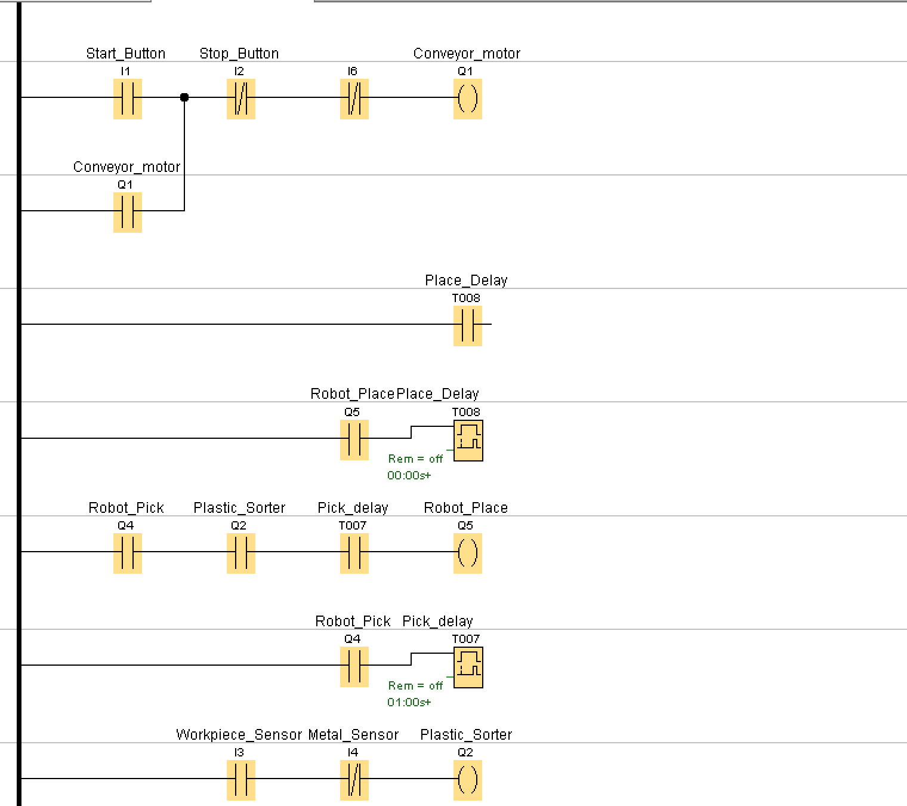
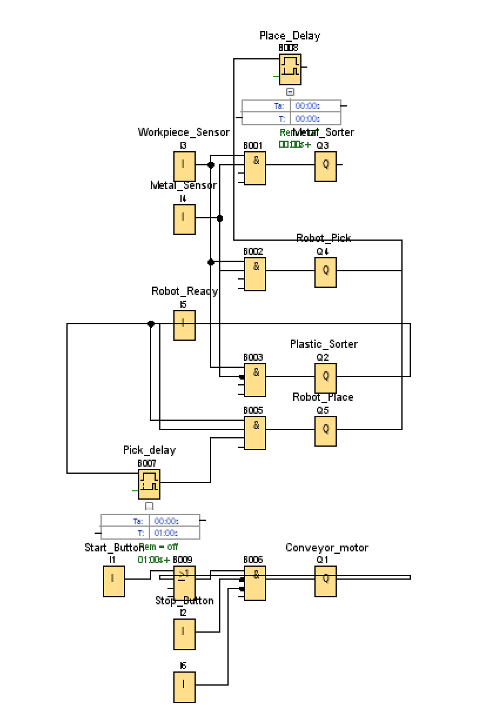

# PLC Conveyor Sorting System (Siemens LOGO!)

This project demonstrates a simple **PLC-based conveyor sorting system** programmed in **Siemens LOGO! Soft Comfort**.

The system detects objects on a conveyor, determines whether they are **metal or plastic**, and triggers a **robot pick-and-place sequence** to sort them.

The program includes:

- Start/Stop conveyor control
- Emergency stop safety
- Object detection
- Metal / plastic classification
- Robot pick-and-place sequence
- Timer-based delays

---

# System Overview

The automation sequence works as follows:

1. The **Start Button** starts the conveyor motor.
2. A **Workpiece Sensor** detects an object on the conveyor.
3. A **Metal Sensor** checks whether the object is metal.
4. The system activates the correct sorting output:
   - Metal objects → **Metal Sorter**
   - Non-metal objects → **Plastic Sorter**
5. If the robot is ready, it performs a **pick operation**.
6. After a short delay, the robot performs a **place operation**.

---

## Ladder Logic

---

# System Inputs

| Input | Name | Description |
|------|------|-------------|
| I1 | Start_Button | Starts the conveyor system |
| I2 | Stop_Button | Stops the conveyor |
| I3 | Workpiece_Sensor | Detects object on conveyor |
| I4 | Metal_Sensor | Detects metal objects |
| I5 | Robot_Ready | Indicates robot is ready |
| I6 | Emergency_Stop | Immediately stops the system |

---

# System Outputs

| Output | Name | Description |
|------|------|-------------|
| Q1 | Conveyor_Motor | Drives the conveyor belt |
| Q2 | Plastic_Sorter | Activates plastic sorting mechanism |
| Q3 | Metal_Sorter | Activates metal sorting mechanism |
| Q4 | Robot_Pick | Robot picks the object |
| Q5 | Robot_Place | Robot places the object |

---

# Timers

| Timer | Name | Function |
|------|------|----------|
| B007 | Pick_Delay | Simulates time needed for robot to pick object |
| B008 | Place_Delay | Simulates time needed for robot to place object |

---

## Function Block Diagram (FBD)

---

# Safety Feature

The system includes an **Emergency Stop** input.

When the emergency stop is activated, the conveyor and system logic are immediately disabled to simulate industrial safety behavior.

---

# Software Used

- Siemens **LOGO! Soft Comfort**
- PLC simulation
- Ladder Logic (LAD)
- Function Block Diagram (FBD)

---

# Author

Marai Abed Alrahman  
Budapest University of Technology and Economics (BME)
