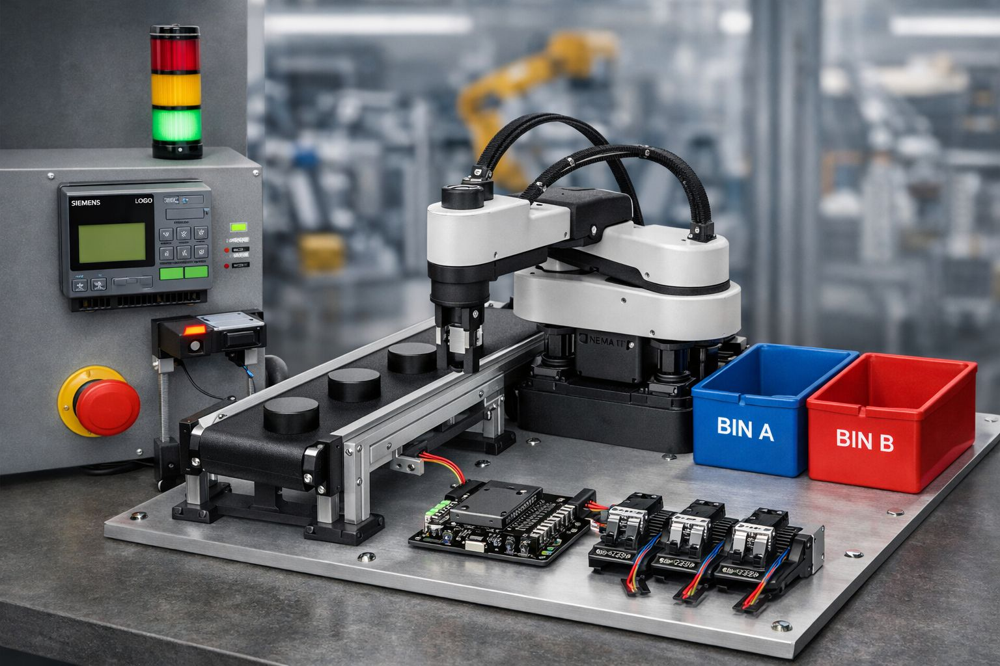

# PLC Conveyor Sorting System (Siemens LOGO!)

  

A simple PLC automation project that sorts workpieces on a conveyor using a metal sensor and a simulated SCARA robot pick-and-place operation.

**Main features**

* Conveyor start/stop control
* Emergency stop safety
* Workpiece detection
* Metal vs plastic classification
* Robot pick-and-place sequence
* Timer-based delays

---

# System Overview

1. **Start Button** starts the conveyor motor.
2. **Workpiece Sensor** detects an object on the conveyor.
3. **Metal Sensor** determines if the object is metal.
4. The correct sorting output is activated:

   * Metal → **Metal Sorter**
   * Non-metal → **Plastic Sorter**
5. If the robot is ready, it performs a **pick** operation.
6. After a delay, the robot performs a **place** operation.

---

# Ladder Logic

  

---

# Inputs

| Input | Name             | Function                     |
| ----- | ---------------- | ---------------------------- |
| I1    | Start_Button     | Starts the conveyor          |
| I2    | Stop_Button      | Stops the conveyor           |
| I3    | Workpiece_Sensor | Detects objects              |
| I4    | Metal_Sensor     | Detects metal                |
| I5    | Robot_Ready      | Robot ready signal           |
| I6    | Emergency_Stop   | Stops the system immediately |

---

# Outputs

| Output | Name           | Function                |
| ------ | -------------- | ----------------------- |
| Q1     | Conveyor_Motor | Drives the conveyor     |
| Q2     | Plastic_Sorter | Sorts plastic objects   |
| Q3     | Metal_Sorter   | Sorts metal objects     |
| Q4     | Robot_Pick     | Robot picks the object  |
| Q5     | Robot_Place    | Robot places the object |

---

# Timers

| Timer | Name        | Function                 |
| ----- | ----------- | ------------------------ |
| B007  | Pick_Delay  | Delay before robot pick  |
| B008  | Place_Delay | Delay before robot place |

---

# Function Block Diagram (FBD)

  

---

# Software

* Siemens **LOGO! Soft Comfort**
* PLC Simulation
* Ladder Logic (LAD)
* Function Block Diagram (FBD)

# Author

Marai Abed Alrahman  
Budapest University of Technology and Economics (BME)
